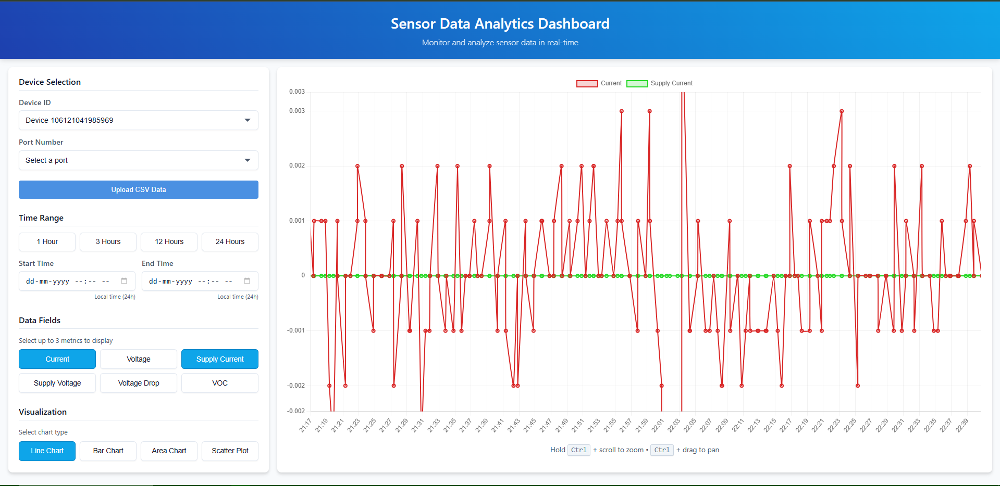

# GoMongoViz - Sensor Data Visualization Dashboard

GoMongoViz is a full-stack sensor data visualization dashboard that allows users to view, analyze, and upload sensor data stored in MongoDB. This application provides real-time monitoring of sensor metrics such as voltage, current, and other measurements with interactive charts and filtering capabilities.



## Features

- **Data Visualization**: Interactive charts with zoom and pan functionality
- **Real-time Monitoring**: View and analyze sensor data in real-time
- **CSV Upload**: Upload sensor data via CSV files
- **Filtering Capabilities**: Filter data by device, port, and time range
- **Multi-metric Analysis**: Compare up to 3 metrics simultaneously
- **Responsive Design**: Works on desktop and mobile devices

## Tech Stack

### Frontend
- React (TypeScript)
- Chart.js for data visualization
- CSS for styling
- Axios for API communication

### Backend
- Go (Golang)
- Gorilla Mux for routing
- MongoDB for data storage
- Clean Architecture pattern

## Project Structure

The project follows a clean architecture pattern with clear separation of concerns:

```
GoMongoViz/
├── BE/                  # Backend (Go)
│   ├── database/        # Database connection
│   ├── handlers/        # HTTP request handlers
│   ├── model/           # Data models
│   ├── repository/      # Data access layer
│   ├── service/         # Business logic
│   └── main.go          # Entry point
├── FE/                  # Frontend (React)
│   ├── public/          # Static files
│   ├── src/             # Source code
│   │   ├── api/         # API clients
│   │   ├── components/  # React components
│   │   ├── types/       # TypeScript types
│   │   └── utils/       # Utilities
│   └── package.json     # Dependencies
└── start_servers.bat    # Startup script
```

## Getting Started

### Prerequisites

- Node.js (v14+)
- Go (v1.16+)
- MongoDB (local or Atlas)

### Installation

1. Clone the repository:
   ```
   git clone https://github.com/yourusername/GoMongoViz.git
   cd GoMongoViz
   ```

2. Using the startup script (Windows):
   - Simply run `start_servers.bat` to install dependencies and start both servers
   - This will open two command windows: one for the frontend and one for the backend

3. Manual installation:

   **Frontend:**
   ```
   cd FE
   npm install
   npm start
   ```

   **Backend:**
   ```
   cd BE
   go run main.go
   ```

4. Access the application:
   - Frontend: http://localhost:3000
   - Backend API: http://localhost:8080

## API Endpoints

- `GET /api/objects` - Get all unique object IDs
- `GET /api/ports/{objectId}` - Get ports for a specific object
- `GET /api/data/{objectId}?port_num={portNum}` - Get data for a specific object and port
- `POST /api/upload` - Upload and process CSV data

## CSV Upload Format

When uploading CSV files, ensure they follow this format:

**Required fields:**
- `timestamp` - Format: YYYY-MM-DDThh:mm:ssZ (RFC3339)
- `object_id` - Sensor object identifier
- `port_num` - Port number
- `voltage` - Voltage reading
- `current` - Current reading
- `supply_current` - Supply current value
- `supply_volt` - Supply voltage
- `voltage_drop` - Voltage drop measurement
- `voc` - Voltage Open Circuit value

**Optional fields include:**
- `state`, `controller_error`, `ai1`-`ai5`, etc.

You can download a sample CSV template from the upload modal.

## File Upload Implementation

The file upload is implemented using a direct `fetch` API call with `FormData` to ensure proper handling of multipart/form-data uploads. This approach avoids common Content-Type header issues that can occur with other HTTP clients.

### Key File Upload Implementation Details

1. **Frontend Implementation**
   - The application uses native `FormData` API for building multipart requests
   - Avoids manually setting Content-Type headers which can cause boundary issues
   - Uses raw `fetch` API instead of axios for uploads to prevent Content-Type conflicts
   - Implements proper error handling and feedback to the user

2. **Backend Implementation**
   - Uses Go's `multipart` package to parse form data
   - Validates file MIME types in a permissive way to support various CSV formats
   - Implements robust error handling with detailed messages
   - Handles CSV parsing and data validation with proper feedback

3. **Common Upload Issues**
   - **Content-Type issues**: If the frontend sets a Content-Type header manually, the backend will reject the upload because it won't have the correct multipart boundary
   - **CORS issues**: Preflight requests must be properly handled for file uploads
   - **File size limits**: The backend limits uploads to 10MB to prevent abuse

4. **Debugging File Uploads**
   - Backend logs include detailed information about incoming requests, including headers and content types
   - Frontend console logs show file information before upload
   - Error responses include detailed information about what went wrong

## Development Notes

- Frontend: The React application uses a proxy configuration to simplify API calls
- Backend: CORS is configured to allow cross-origin requests for development

## MongoDB Configuration

The MongoDB connection is configured in `BE/database/db.go`. Update the credentials to match your MongoDB instance.

## License

[MIT License](LICENSE)

## Acknowledgements

- [Chart.js](https://www.chartjs.org/)
- [React](https://reactjs.org/)
- [Go](https://golang.org/)
- [MongoDB](https://www.mongodb.com/)

## Troubleshooting

### Common Issues

1. **"Cannot POST /api/upload" Error**
   - **Cause**: The backend server isn't running or there's a CORS issue
   - **Solution**: 
     - Ensure the backend server is running on port 8080
     - Check the browser console for CORS errors
     - Verify that the frontend is using the correct API URL

2. **"request Content-Type isn't multipart/form-data" Error**
   - **Cause**: The Content-Type header is incorrect or manually set in the request
   - **Solution**:
     - Don't manually set Content-Type header in upload requests
     - Use the FormData API without modifying headers
     - Use the fetch API directly instead of axios for file uploads

3. **MongoDB Connection Issues**
   - **Cause**: Incorrect MongoDB credentials or connection string
   - **Solution**:
     - Update credentials in `BE/database/db.go`
     - Check MongoDB Atlas connection status
     - Verify network connectivity to MongoDB

4. **Missing Required Fields in CSV**
   - **Cause**: The CSV file doesn't include all required fields
   - **Solution**:
     - Use the sample CSV template provided in the app
     - Ensure all required fields are included
     - Check field names for exact spelling and case

5. **Frontend Not Connecting to Backend**
   - **Cause**: Proxy configuration issues or incorrect API URLs
   - **Solution**:
     - Check `FE/package.json` for correct proxy configuration
     - Verify base URL in `FE/src/api/Client.ts`
     - Ensure the backend CORS configuration allows requests from the frontend

### Debugging Tips

- Check browser developer console (F12) for network requests and errors
- Review backend logs for detailed request information
- Use the sample CSV template for testing uploads
- Ensure MongoDB connection is working properly 